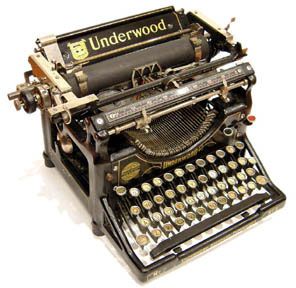
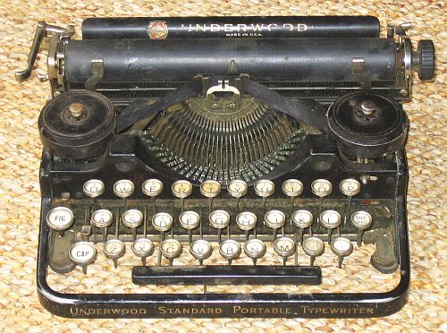
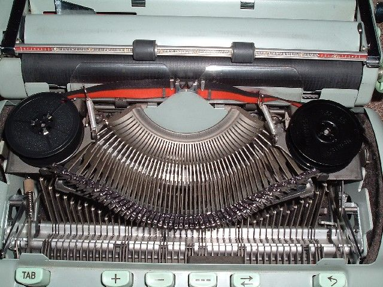
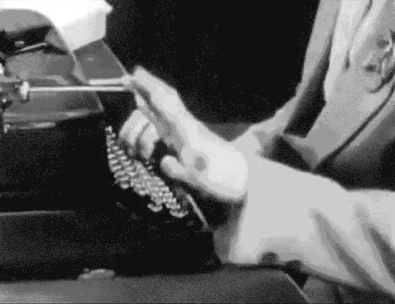

# 机械打字机的工作原理 #

打字机就是用来打字的，机械打字机就是通过机械运动来打字的打字机，其他的还有
激光打字机，他们的区别类似于机械鼠标和光电鼠标之间的区别。

#### 机械打字机的组成部分 ####

----------

下面是一个机械打字机的内部视图，

横着的黑色圆筒放置纸张，红色彩带以及它上面的黑色彩带叫做“色带”，其上沾有油墨，
什么颜色的色带就能打出什么颜色的文字，色带两边的两个黑色圆形盒子是色带盒，
两个色带盒之间的部分是“字盘”，字盘由一堆字锭(typebar)组成，字锭就是印有字母的金属块，
注意字母都是“反”着印的，见下图，

下图则是打字机的内部草图，

#### 机械打字机是如何工作的 ####

----------

了解了机械打字机内部组成之后，我们来看看它是如何工作的。

键盘上每一个字符，不论是字母还是符号，都对应到一个字锭(typebar)，
当按下某个键之后，该字锭就会打击色带，进而隔着色带击打到纸张上面，
对应的字母就会被打印到纸上，

上图中圆圈代表放置纸张的圆筒，其上放有纸张，击打圆筒的就是字锭，在字锭与圆筒之间
还应该有一个色带，图中并没有画出。下图则是打字机实际工作的情形，字锭在不停的击打
色带，每次字锭击打过来时，色带就准备好，迎接字锭的击打，击打完成之后圆筒带着纸张
往左一定一个格，用来打印下一个字符。

注意看字锭的柄，有时是正对着色带，而有时则是歪着的，这是因为字盘是圆形的，但是
不论何时，字锭总是正对着色带进行击打。

另外还需注意，字锭只做击打动作，并没有左右移动，左右移动，从而使得文字成行的是
纸张(圆筒)。

#### 什么是回车换行 ####

----------

随着纸张不断往左移动，文字被印成一行，但是当到达纸张的右端，即一行被印完了，又该
怎么办呢？

一行打印完成之后，需要打印下一行，这需要两个动作来完成，

1.	通过Carriage控制杆将纸张往右移动，从而使字锭打击位置回到纸张的左端，这叫做
	Carriage Return
2.	纸张往上移动一行，即进纸，这叫做Line Feed

现代计算机中的回车(Carriage Return)换行(Line Feed)就是来自于打字机的这种设计。

(全文结束)